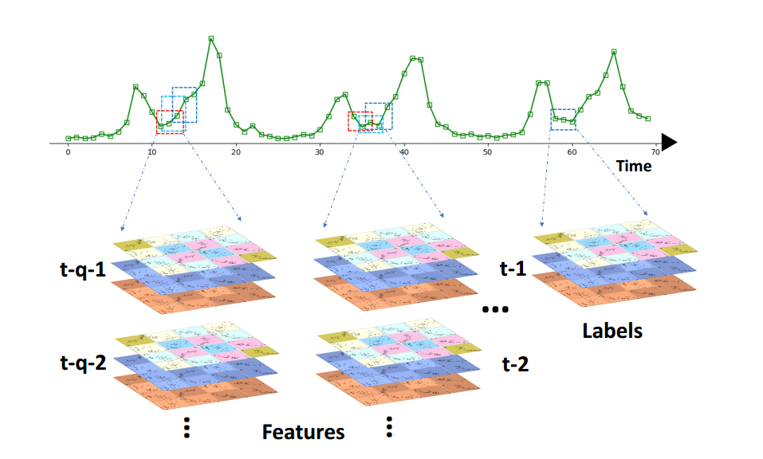

# STPWNet
Traffc is a relatively broad concept, including transportation, travel, trade, and internet networks. It is a kind of method to analyze, model and give
predictive results for a given sequence with temporal and spatial relations. Traffc forecasting has always been a hot issue for researchers. It is a nonstationary time series with a high degree of nonlinearity, and it is very challenging to accurately forecast it. We propose a novel self-supervision Spatiotemporal Part-Whole Convolutional Neural Network (STPWNet), which simultaneously captures the temporal and spatial correlations of the traffc sequence to accurately predict the traffc data at the next moment. In order to improve the inference accuracy and speed of the deep network, we designed a lightweight convolutional network module with a partial to overall structure to improve the accuracy and speed of network prediction. Compared with traditional neural networks, STPWNet has fewer parameters, faster inference speed, and can produce good prediction performance on a variety of traffic data sets. We propose a novel self-supervision Spatiotemporal Part-Whole Convolutional Neural Network (STPWNet), which simultaneously captures the temporal and spatial correlations of the traffc sequence to accurately predict the traffc data at the next moment. **Please refer to our paper "Self-supervision Spatiotemporal Part-Whole Convolutional Neural Network for Traffc Predection".**

